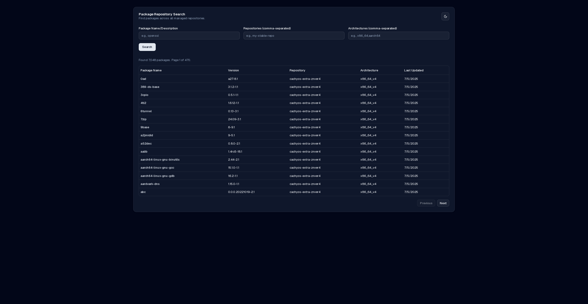
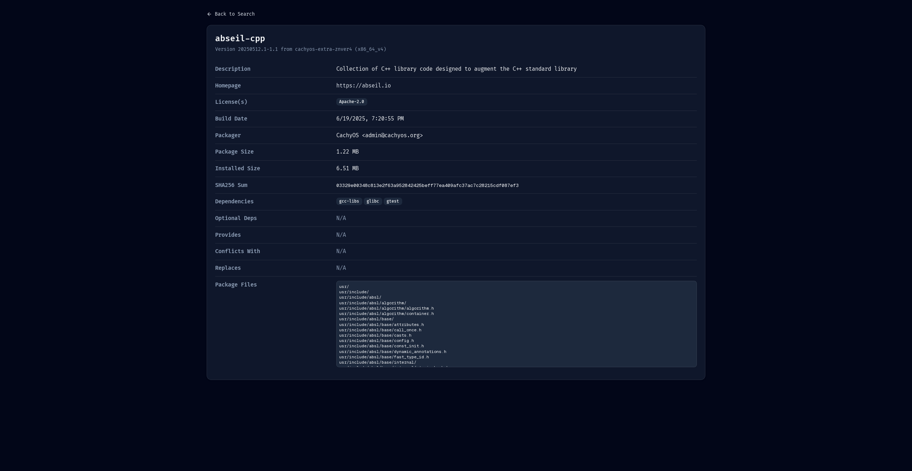

# Repo Manage Util - Web Dashboard

The web dashboard for the Repo Manage Util provides a user-friendly interface to search and manage packages within your repositories.

## Features

*   **Package Search:** Search for packages across all configured repositories.
*   **Package Details:** View detailed information about a specific package.
*   **Responsive Design:** The dashboard is designed to work on various screen sizes.
*   **Themeable:** Light and dark mode support.

## Screenshots

**Main Search Page:**


**Package Details Page:**


### Prerequisites

*   [Node.js](https://nodejs.org/) (v20 or later)
*   [Bun](https://bun.sh/) (v1.2 or later)

### Installation

1.  Clone the repository:
    ```bash
    git clone https://github.com/cachyos/repo-manage-util.git
    cd repo-manage-util/web-dashboard
    ```

2.  Install the dependencies:
    ```bash
    bun --bun install
    ```

3.  Start the development server:
    ```bash
    bun --bun run dev
    ```

The application will be available at [http://localhost:3000](http://localhost:3000).

### Building for Production

To create a production-ready build, run the following command:

```bash
bun --bun run build
```

This will create an optimized build in the `.next` directory. To run the production server, use:

```bash
bun run start
```

## Building and Running with Docker

You can also build and run the web dashboard using Docker.

### Build the Docker Image

To build the Docker image, run the following command from the `web-dashboard` directory:

```bash
docker build -t repo-manage-dashboard .
```

### Run the Docker Container

To run the Docker container, use the following command:

```bash
docker run -p 3000:3000 repo-manage-dashboard
```

The application will be available at [http://localhost:3000](http://localhost:3000).
